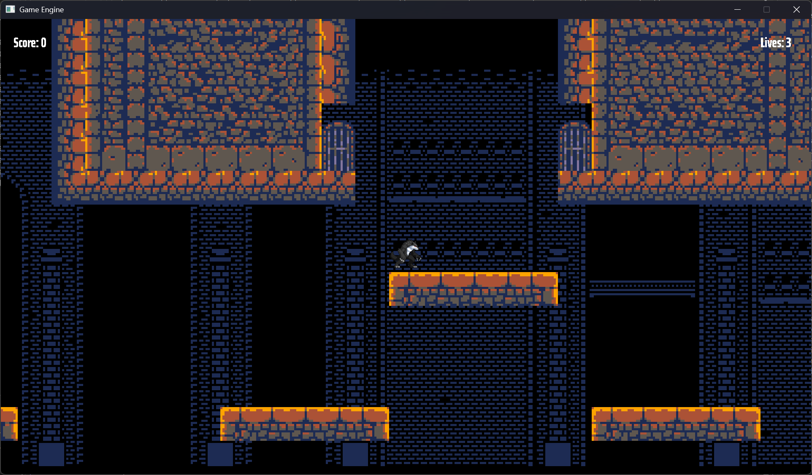
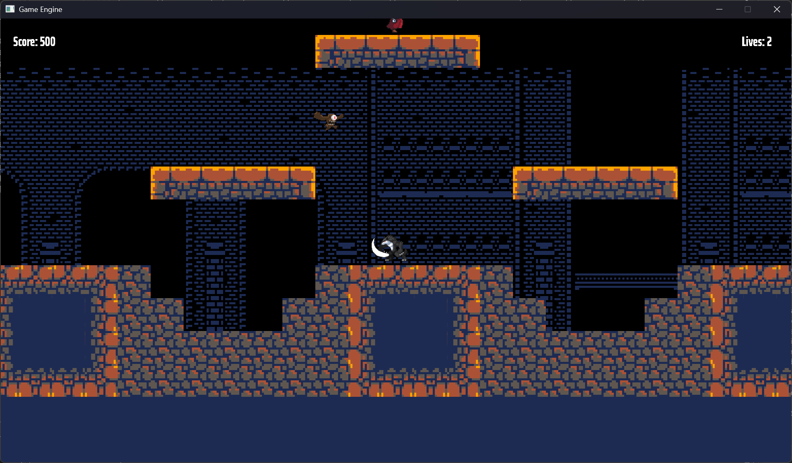

# GAT150 — Course Game Project

## Brief description

This repository contains a small game developed for the GAT150 course. The project contains the game code, assets, and a lightweight game engine layer used during development. Replace or expand the sections below with project-specific details (game title, engine used, authorship) as needed.

## Game and Engine

- Game title: Survival
- Genre: 2D Platformer
- Engine/framework: Custom

Short description: A compact course project that demonstrates core game systems such as input handling, rendering, collision, simple AI, and scoring. The engine is a small framework created for the course (or an engine such as Unity/MonoGame/SDL if applicable). Document exact engine and version here.

## Core features

- Player movement and input handling
- Level / scene management
- Basic enemies with simple AI
- Collision detection and response
- Scoring and game over conditions
- Audio playback (SFX and music)

## Screenshots

## Building and running

- Visual Studio:
  1. Open the solution file (.sln) in Visual Studio 2026.
  2. Set the desired startup project in Solution Explorer.
  3. Select the correct configuration (Debug/Release) and platform (x86/x64).
  4. Build: Build -> Build Solution (Ctrl+Shift+B).
  5. Run: Start Debugging (F5) or Start Without Debugging (Ctrl+F5).

## Controls

- Move: A and D
- Jump: W
- Attack: Space
- Quit: Esc

## Known issues / limitations

- [ ] Placeholder: Box2D can cause crashes after killing an enemy / Getting killed
- [ ] Placeholder: simple AI can become stuck on level geometry

## Credits and external assets

- Audio: Sounds Resource — Deltarune SFX by Toby Fox
- Libraries: SDL3 / Fmod / Box2D / RapidJSON 
- Fonts: Google Fonts — Saira Extra Condensed by Omnibus-Type

## Contact / Authors

Course: GAT150
Author(s): BorealTheOtter

For questions or contributions, open an issue or submit a pull request on the repository.

---
